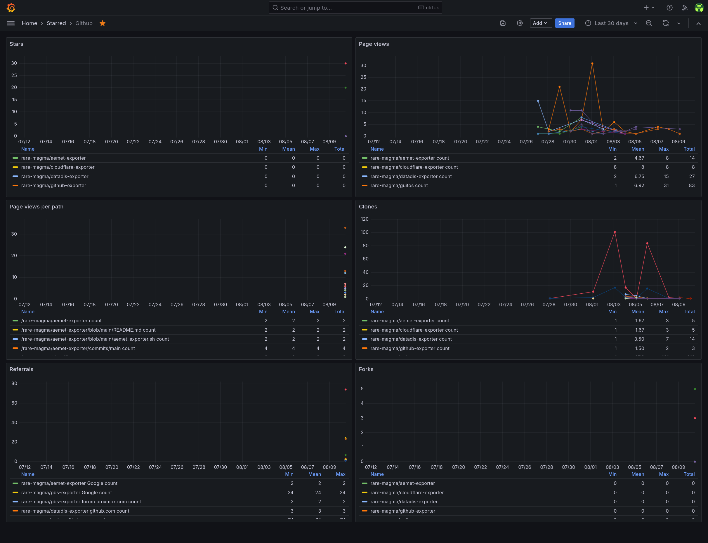

# github-exporter

CLI tool that uploads the Github traffic and statistics API data to influxdb on a daily basis

## Dependencies

- [go](https://go.dev/)
- Optional:
  - [make](https://www.gnu.org/software/make/) - for automatic installation support
  - [docker](https://docs.docker.com/)
  - [systemd](https://systemd.io/)

## Relevant documentation

- [Github API](https://docs.github.com/en/rest/quickstart?apiVersion=2022-11-28)
- [InfluxDB API](https://docs.influxdata.com/influxdb/v2.6/write-data/developer-tools/api/)
- [Systemd Timers](https://www.freedesktop.org/software/systemd/man/systemd.timer.html)
- [reddec/compose-scheduler](https://github.com/reddec/compose-scheduler)

## Installation

### With Docker

#### docker-compose

1. Configure `github_exporter.json` (see the configuration section below).
1. Run it.

   ```bash
   docker compose up --detach
   ```

#### docker build & run

1. Build the docker image.

   ```bash
   docker build . --tag github-exporter
   ```

1. Configure `github_exporter.json` (see the configuration section below).
1. Run it.

   ```bash
    docker run --rm --init --tty --interactive --read-only --cap-drop ALL --security-opt no-new-privileges:true --cpus 2 -m 64m --pids-limit 16 --volume ./github_exporter.json:/app/github_exporter.json:ro ghcr.io/rare-magma/github-exporter:latest
    ```

### With the Makefile

For convenience, you can install this exporter with the following command or follow the manual process described in the next paragraph.

```bash
make build
make install
$EDITOR $HOME/.config/github_exporter.json
```

### Manually

1. Build `github_exporter` with:

   ```bash
   go build -ldflags="-s -w" -o github_exporter main.go
   ```

2. Copy `github_exporter` to `$HOME/.local/bin/`.

3. Copy `github_exporter.json` to `$HOME/.config/`, configure them (see the configuration section below) and make them read only.

4. Copy the systemd unit and timer to `$HOME/.config/systemd/user/`:

   ```bash
   cp github-exporter.* $HOME/.config/systemd/user/
   ```

5. and run the following command to activate the timer:

   ```bash
   systemctl --user enable --now github-exporter.timer
   ```

It's possible to trigger the execution by running manually:

```bash
systemctl --user start github-exporter.service
```

### Config file

The config file has a few options:

```json
{
 "InfluxDBHost": "influxdb.example.com",
 "InfluxDBApiToken": "ZXhhbXBsZXRva2VuZXhhcXdzZGFzZGptcW9kcXdvZGptcXdvZHF3b2RqbXF3ZHFhc2RhCg==",
 "Org": "home",
 "Bucket": "github",
 "GithubApiToken": "ZXhhbXBsZXRva2VuZXhhcXdzZGFzZGptcW9kcXdvZGptcXdvZHF3b2RqbXF3ZHFhc2RhCg=="
}
```

- `InfluxDBHost` should be the FQDN of the influxdb server.
- `Org` should be the name of the influxdb organization that contains the github data bucket defined below.
- `Bucket` should be the name of the influxdb bucket that will hold the github data.
- `InfluxDBApiToken` should be the influxdb API token value.
  - This token should have write access to the `BUCKET` defined above.
- `GithubApiToken` should be the Github API token value.
  - This token should be assigned the "Administration" repository permissions (read) permission.

## Troubleshooting

Check the systemd service logs and timer info with:

```bash
journalctl --user --unit github-exporter.service
systemctl --user list-timers
```

## Exported metrics

- github_stats_clones: Number of unique git clones and total count per repo
- github_stats_paths: Number of unique views and total count per path in each repo
- github_stats_referrals: Number of unique referrals and total count per repo
- github_stats_views: Number of unique views and total count per repo
- github_stats_stars: Number of stars per repo
- github_stats_forks: Number of forks per repo

## Exported metrics example

```bash
github_stats_clones,repo=rare-magma/guitos count=1,uniques=1 1722124800
github_stats_paths,repo=rare-magma/guitos,path=/rare-magma/guitos/blob/main/docs/images/tooltip.png count=2,uniques=1 1723285062
github_stats_referrals,repo=rare-magma/guitos,referrer=github.com count=74,uniques=23 1723285062
github_stats_views,repo=rare-magma/guitos count=1,uniques=1 1723161600
github_stats_stars,repo=rare-magma/guitos count=30 1723285063
github_stats_forks,repo=rare-magma/guitos count=3 1723285063
```

## Example grafana dashboard

In `github-dashboard.json` there is an example of the kind of dashboard that can be built with `github-exporter` data:



Import it by doing the following:

1. Create a dashboard
2. Click the dashboard's settings button on the top right.
3. Go to JSON Model and then paste there the content of the `github-dashboard.json` file.

## Uninstallation

### With the Makefile

For convenience, you can uninstall this exporter with the following command or follow the process described in the next paragraph.

```bash
make uninstall
```

### Manually

Run the following command to deactivate the timer:

```bash
systemctl --user disable --now github-exporter.timer
```

Delete the following files:

```bash
~/.local/bin/github_exporter
~/.config/github_exporter.json
~/.config/systemd/user/github-exporter.timer
~/.config/systemd/user/github-exporter.service
```

## Credits

- [reddec/compose-scheduler](https://github.com/reddec/compose-scheduler)
- [google/go-github](https://github.com/google/go-github)
